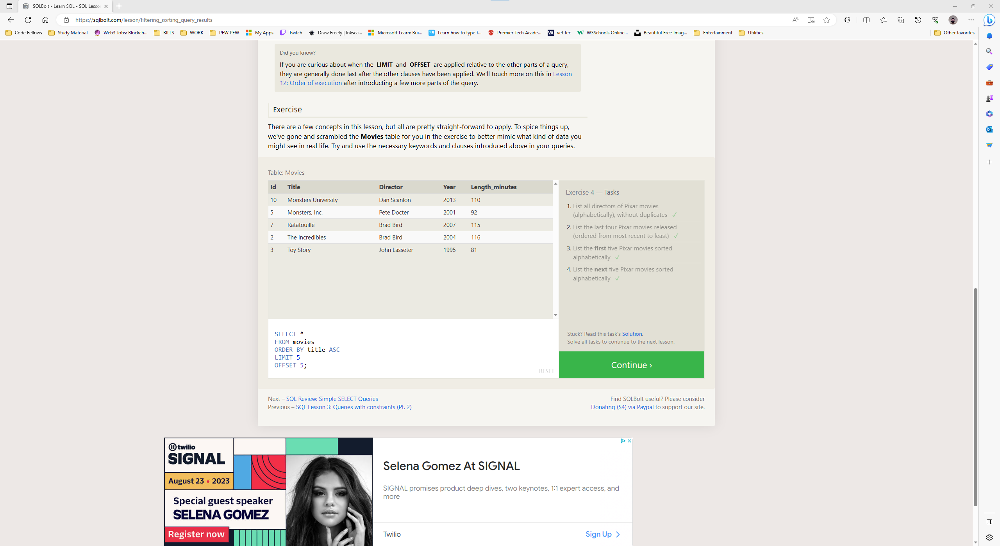

# SQL Prep

Summary of Lessons 1-6, 13-18 and Algorithm Code Blocks:

Lesson 1: SELECT queries 101

- Basic SELECT queries to retrieve specific columns from a table or all columns using "*".

Lesson 2: Queries with constraints (Pt.1)

- Using constraints like WHERE, BETWEEN, NOT BETWEEN, IN, and NOT IN to filter query results.

Lesson 3: Queries with constraints (Pt.2)

| Operator | Condition                                           | Example                                       |
|---------|-----------------------------------------------------|-----------------------------------------------|
| =       | Case sensitive exact string comparison             | col_name = "abc"                              |
| != or <>| Case sensitive exact string inequality comparison  | col_name != "abcd"                            |
| LIKE    | Case insensitive exact string comparison           | col_name LIKE "ABC"                           |
| NOT LIKE| Case insensitive exact string inequality comparison| col_name NOT LIKE "ABCD"                      |
| %       | Used anywhere in a string to match zero or more characters (only with LIKE or NOT LIKE) | col_name LIKE "%AT%" (matches "AT", "ATTIC", "CAT" or even "BATS") |
| _       | Used anywhere in a string to match a single character (only with LIKE or NOT LIKE) | col_name LIKE "AN_" (matches "AND", but not "AN") |
| IN (…)  | String exists in a list                             | col_name IN ("A", "B", "C")                   |
| NOT IN (…)| String does not exist in a list                    | col_name NOT IN ("D", "E", "F")               |

- Introducing string comparison and pattern matching operators like =, !=, LIKE, NOT LIKE, %, _, IN, and NOT IN.

Lesson 4: Filtering and sorting query results

- Using DISTINCT to remove duplicates from query results.
- Sorting query results using ORDER BY in ascending or descending order.
- Limiting the number of rows returned using LIMIT and OFFSET.

```markdown
SELECT column, another_column, …
FROM mytable
WHERE condition(s)
ORDER BY column ASC/DESC
LIMIT num_limit OFFSET num_offset;
```

Lesson 5: SQL Review: Simple SELECT queries

- Reviewing simple SELECT queries with various conditions and ordering.

Lesson 6: Multi-table queries with JOINs

```markdown
SELECT column, another_table_column, …
FROM mytable
INNER JOIN another_table
    ON mytable.id = another_table.id
WHERE condition(s)
ORDER BY column, … ASC/DESC
LIMIT num_limit OFFSET num_offset;
```

- Understanding INNER JOIN to combine rows from two tables based on a common key.
- Applying other clauses with JOINs like WHERE and ORDER BY.

Lesson 13: Inserting rows

```markdown
INSERT INTO mytable (column1, column2, column3)
VALUES (value1, value2, value3),
       (value4, value5, value6),
```

- Using INSERT INTO to add new rows to a table.

Lesson 14: Updating rows

- Using UPDATE to modify existing rows in a table.

Lesson 15: Deleting rows

- Using DELETE to remove rows from a table.

Lesson 16: Creating tables

```markdown
CREATE TABLE IF NOT EXISTS employees (
    id INTEGER PRIMARY KEY,
    name TEXT NOT NULL,
    age INTEGER,
    department TEXT DEFAULT 'HR'
);
```
| Data Type        | Description                                                                                       |
|------------------|---------------------------------------------------------------------------------------------------|
| INTEGER          | Store whole integer values (e.g., count of a number or an age).                                   |
| BOOLEAN          | Store true/false values (sometimes represented as 0 or 1).                                        |
| FLOAT            | Store floating-point numbers with single-precision.                                               |
| DOUBLE           | Store floating-point numbers with double-precision.                                               |
| REAL             | Store floating-point numbers with real precision.                                                 |
| CHARACTER(num_chars)  | Store fixed-length strings with a specified number of characters.                                |
| VARCHAR(num_chars)    | Store variable-length strings with a maximum number of characters.                               |
| TEXT             | Store large blocks of text and strings.                                                           |
| DATE             | Store date values without the time component.                                                     |
| DATETIME         | Store date and time values.                                                                      |
| BLOB             | Store binary data, like images or files.                                                         |

| Constraint     | Description                                                                                       |
|----------------|---------------------------------------------------------------------------------------------------|
| PRIMARY KEY    | Values in this column are unique identifiers for each row.                                        |
| AUTOINCREMENT  | Automatically fill and increment integer values with each row insertion (not supported in all databases). |
| UNIQUE         | Values in this column must be unique; prevents duplicate entries.                                 |
| NOT NULL       | Inserted value cannot be NULL; requires a valid value.                                           |
| CHECK (expression) | Validate values using a complex expression (e.g., positive, greater than a specific size, etc.). |
| FOREIGN KEY    | Enforce consistency by linking values in this column to another table's column.                  |


- Understanding how to create new tables and define data types and constraints for columns.

Lesson 17: Altering tables

- Modifying existing tables by adding new columns using ALTER TABLE ADD.
- Removing columns using ALTER TABLE DROP.
- Renaming tables using ALTER TABLE RENAME TO.

Lesson 18: Dropping tables

```markdown
DROP TABLE IF EXISTS mytable;
```

- Using DROP TABLE to delete existing tables.

## References
<!-- used CHATGPT to create tables -->

### SQL Bolt SC





